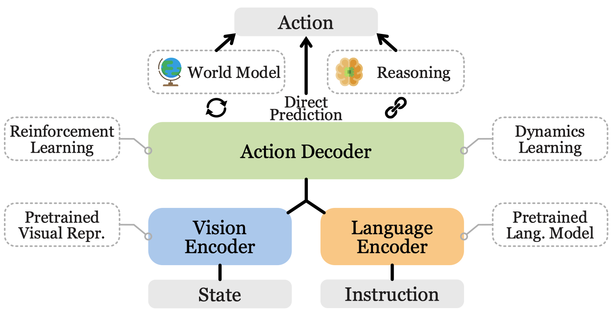
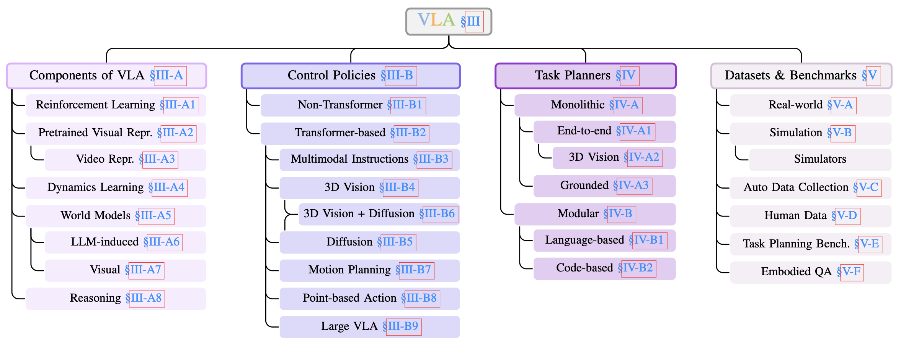
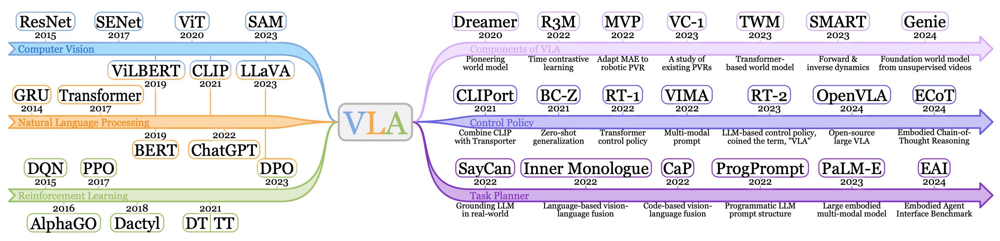
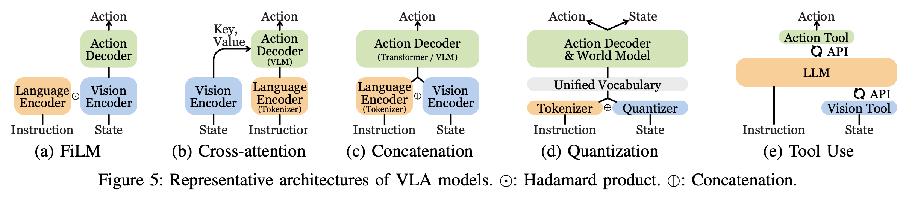
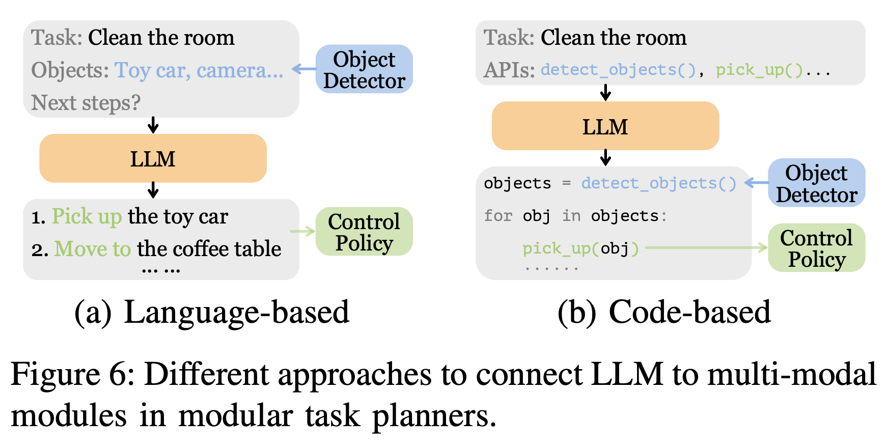

# Awesome VLA

## A Survey on Vision-Language-Action Models for Embodied AI

[](https://arxiv.org/abs/2405.14093)
<a href="https://github.com/Panmani/Awesome-VLA/pulls"></a>
<a href="https://github.com/Panmani/Awesome-VLA/issues"></a>
[](https://github.com/sindresorhus/awesome)

Yueen Ma<sup>1</sup>, Zixing Song<sup>1</sup>, Yuzheng Zhuang<sup>2</sup>, Jianye Hao<sup>2</sup>, Irwin King<sup>1</sup>

1. The Department of Computer Science and Engineering, The Chinese University of Hong Kong, Hong Kong, China (Email: {yema21, zxsong, king}@cse.cuhk.edu.hk)

2. Huawei Noah's Ark Lab, Shenzhen, China (Email: {zhuangyuzheng, haojianye}@huawei.com)

The official repo of the survey, containing a curated list of papers on **Vision-Language-Action Models for Embodied AI**. 



Feel free to send us [pull requests](https://github.com/Panmani/Awesome-VLA/blob/main/how-to-PR.md) or [emails](mailto:yema21@cse.cuhk.edu.hk) to add papers! <br>

If you find this repository useful, please consider [citing](#citation), staring, and sharing with others!

## Content

- [Components of VLA](#components-of-vla)
  - [Reinforcement Learning](#reinforcement-learning)
  - [Pretrained Visual Representations](#pretrained-visual-representations)
    - [Video Representations](#video-representations)
  - [Dynamics Learning](#dynamics-learning)
  - [World Models](#world-models)
    - [LLM-induced World Models](#llm-induced-world-models)
    - [Visual World Models](#visual-world-models)
  - [Reasoning](#reasoning)
- [Low-level Control Policies](#low-level-control-policies)
  - [Non-Transformer Control Policies](#non-transformer-control-policies)
  - [Transformer-based Control Policies](#transformer-based-control-policies)
    - [Control Policies for Multimodal Instructions](#control-policies-for-multimodal-instructions)
    - [Control Policies with 3D Vision](#control-policies-with-3d-vision)
    - [Diffusion-based Control Policies](#diffusion-based-control-policies)
    - [Diffusion-based Control Policies with 3D Vision](#diffusion-based-control-policies-with-3d-vision)
    - [Control Policies for Motion Planning](#control-policies-for-motion-planning)
    - [Control Policies with Point-based Action](#control-policies-with-point-based-action)
    - [Large VLA](#large-vla)
- [High-level Task Planners](#high-level-task-planners)
  - [Monolithic Task Planners](#monolithic-task-planners)
    - [Grounded Task Planners](#grounded-task-planners)
    - [End-to-end Task Planners](#end-to-end-task-planners)
    - [End-to-end Task Planners with 3D Vision](#end-to-end-task-planners-with-3d-vision)
  - [Modular Task Planners](#modular-task-planners)
    - [Language-based Task Planners](#language-based-task-planners)
    - [Code-based Task Planners](#code-based-task-planners)
- [Related Surveys](#related-surveys)
- [Latest Developments](#latest-developments)
  - [Humanoid Robot](#humanoid-robot)
  - [Quadruped Robot](#quadruped-robot)
  - [Dexterous Hand](#dexterous-hand)
- [Citation](#citation)


## Definitions

- **Generalized VLA**  
  *Input:* state, instruction.  
  *Output:* action.  

- **Large VLA**  
  A special type of generalized VLA that is adapted from large VLMs. (Same as VLA defined by RT-2.)


## Taxonomy



## Timelines



## Components of VLA

### Reinforcement Learning
<!-- DBLP:conf/nips/ChenLRLGLASM21, Decision Transformer: Reinforcement Learning via Sequence Modeling -->
* **DT**: "Decision Transformer: Reinforcement Learning via Sequence Modeling", *NeurIPS, 2021* [[Paper](https://arxiv.org/abs/2106.01345)][[Code](https://github.com/kzl/decision-transformer)]
<!-- DBLP:conf/nips/JannerLL21, Offline Reinforcement Learning as One Big Sequence Modeling Problem -->
* **Trajectory Transformer**: "Offline Reinforcement Learning as One Big Sequence Modeling Problem", *NeurIPS, 2021* [[Paper](http://arxiv.org/abs/2106.02039v4)][[Code](https://github.com/Farama-Foundation/D4RL)]
<!-- DBLP:conf/iros/HiranakaHLW00Z23, Primitive Skill-Based Robot Learning from Human Evaluative Feedback -->
* **SEED**: "Primitive Skill-based Robot Learning from Human Evaluative Feedback", *IROS, 2023* [[Paper](http://arxiv.org/abs/2307.15801v2)][[Code](https://github.com/mj-hwang/seed)]
<!-- DBLP:conf/nips/ShinnCGNY23, Reflexion: language agents with verbal reinforcement learning -->
* **Reflexion**: "Reflexion: Language Agents with Verbal Reinforcement Learning", *NeurIPS, 2023* [[Paper](http://arxiv.org/abs/2303.11366v4)][[Code](https://github.com/noahshinn/reflexion)]

### Pretrained Visual Representations
<!-- DBLP:conf/icml/RadfordKHRGASAM21, Learning Transferable Visual Models From Natural Language Supervision -->
* "Learning Transferable Visual Models From Natural Language Supervision", *ICML, 2021* [[Paper](http://arxiv.org/abs/2103.00020v1)][[Website](https://openai.com/index/clip/)][[Code](https://github.com/openai/CLIP)]
<!-- DBLP:conf/corl/RadosavovicXJAM22, Real-World Robot Learning with Masked Visual Pre-training -->
* **MVP**: "Real-World Robot Learning with Masked Visual Pre-training", *CoRL, 2022* [[Paper](http://arxiv.org/abs/2203.06173v1)][[Website](https://tetexiao.com/projects/real-mvp)][[Code](https://github.com/ir413/mvp)]
<!-- DBLP:conf/rss/KaramchetiNCKFS23, Language-Driven Representation Learning for Robotics -->
* **Voltron**: "Language-Driven Representation Learning for Robotics", *RSS, 2023* [[Paper](https://arxiv.org/abs/2302.12766)]
<!-- DBLP:conf/nips/MajumdarYAMCSJB23, Where are we in the search for an Artificial Visual Cortex for Embodied Intelligence? -->
* **VC-1**: "Where are we in the search for an Artificial Visual Cortex for Embodied Intelligence?", *NeurIPS, 2023* [[Paper](http://arxiv.org/abs/2303.18240v2)][[Website](https://eai-vc.github.io)][[Code](https://github.com/facebookresearch/eai-vc)]
<!-- DBLP:conf/icml/ParisiRP022, The Unsurprising Effectiveness of Pre-Trained Vision Models for Control -->
* "The (Un)surprising Effectiveness of Pre-Trained Vision Models for Control", *ICML, 2022* [[Paper](http://arxiv.org/abs/2203.03580v2)]
<!-- DBLP:conf/corl/NairRKF022, R3M: A Universal Visual Representation for Robot Manipulation -->
* **R3M**: "R3M: A Universal Visual Representation for Robot Manipulation", *CoRL, 2022* [[Paper](http://arxiv.org/abs/2203.12601v3)][[Website](https://sites.google.com/view/robot-r3m/)][[Code](https://github.com/facebookresearch/r3m)]
<!-- DBLP:conf/iclr/MaSJBK023, VIP: Towards Universal Visual Reward and Representation via Value-Implicit Pre-Training -->
* **VIP**: "VIP: Towards Universal Visual Reward and Representation via Value-Implicit Pre-Training", *ICLR, 2023* [[Paper](https://arxiv.org/abs/2210.00030)][[Website](https://sites.google.com/view/vip-rl)][[Code](https://github.com/facebookresearch/vip)]
<!-- DBLP:journals/tmlr/OquabDMVSKFHMEA24, DINOv2: Learning Robust Visual Features without Supervision -->
* **DINOv2**: "DINOv2: Learning Robust Visual Features without Supervision", *Trans. Mach. Learn. Res., 2023* [[Paper](http://arxiv.org/abs/2304.07193v2)][[Code](https://github.com/facebookresearch/dinov2)]
<!-- DBLP:conf/corl/RadosavovicSFGD23, Robot Learning with Sensorimotor Pre-training -->
* **RPT**: "Robot Learning with Sensorimotor Pre-training", *CoRL, 2023* [[Paper](https://arxiv.org/abs/2306.10007)][[Website](https://robotic-pretrained-transformer.github.io)]
<!-- DBLP:conf/cvpr/AssranDMBVRLB23, Self-Supervised Learning from Images with a Joint-Embedding Predictive Architecture -->
* **I-JEPA**: "Self-Supervised Learning from Images with a Joint-Embedding Predictive Architecture", *CVPR, 2023* [[Paper](http://arxiv.org/abs/2301.08243v3)]
<!-- shang2024theia, Theia: Distilling Diverse Vision Foundation Models for Robot Learning -->
* **Theia**: "Theia: Distilling Diverse Vision Foundation Models for Robot Learning", *CoRL, 2024* [[Paper](http://arxiv.org/abs/2407.20179v2)]

* **HRP**: "HRP: Human Affordances for Robotic Pre-Training", *RSS, 2024* [[Paper](https://arxiv.org/abs/2407.18911)][[Website](https://hrp-robot.github.io)][[Code](https://github.com/SudeepDasari/data4robotics/tree/hrp_release)]

<!-- v5-TODO -->
* **HPT**: "Scaling Proprioceptive-Visual Learning with Heterogeneous Pre-trained Transformers", *NeurIPS, 2024* [[Paper](https://arxiv.org/abs/2409.20537)][[Website](https://liruiw.github.io/hpt)][[Code](https://github.com/liruiw/HPT)]


### Video Representations
<!-- DBLP:conf/corl/ShenYYWKI23, Distilled Feature Fields Enable Few-Shot Language-Guided Manipulation -->
* **F3RM**: "Distilled Feature Fields Enable Few-Shot Language-Guided Manipulation", *CoRL, 2023* [[Paper](http://arxiv.org/abs/2308.07931v2)][[Website](https://f3rm.github.io)][[Code](https://github.com/f3rm/f3rm)]
<!-- DBLP:conf/cvpr/XieZQLF0J24, PhysGaussian: Physics-Integrated 3D Gaussians for Generative Dynamics -->
* **PhysGaussian**: "PhysGaussian: Physics-Integrated 3D Gaussians for Generative Dynamics", *CVPR, 2024* [[Paper](https://arxiv.org/abs/2311.12198)][[Website](https://xpandora.github.io/PhysGaussian/)][[Code](https://github.com/XPandora/PhysGaussian)]
<!-- li2025unigs, UniGS: Unified Language-Image-3D Pretraining with Gaussian Splatting -->
* **UniGS**: "UniGS: Unified Language-Image-3D Pretraining with Gaussian Splatting", *ICLR, 2025* [[Paper](http://arxiv.org/abs/2502.17860v2)][[Code](https://github.com/Li-Hao-yuan/UniGS)]
<!-- DBLP:conf/corl/ThankarajP23, That Sounds Right: Auditory Self-Supervision for Dynamic Robot Manipulation -->
* **That Sounds Right**: "That Sounds Right: Auditory Self-Supervision for Dynamic Robot Manipulation", *CoRL, 2023* [[Paper](http://arxiv.org/abs/2210.01116v1)][[Code](https://audio-robot-learning.github.io)]

### Dynamics Learning
<!-- DBLP:conf/nips/Liu0GA22, Masked Autoencoding for Scalable and Generalizable Decision Making -->
* **MaskDP**: "Masked Autoencoding for Scalable and Generalizable Decision Making", *NeurIPS, 2022* [[Paper](http://arxiv.org/abs/2211.12740v2)][[Code](https://github.com/FangchenLiu/MaskDP_public)]
<!-- DBLP:conf/iros/BonattiVMFCK23, PACT: Perception-Action Causal Transformer for Autoregressive Robotics Pre-Training -->
* **PACT**: "PACT: Perception-Action Causal Transformer for Autoregressive Robotics Pre-Training", *IROS, 2023* [[Paper](https://arxiv.org/abs/2209.11133)]
<!-- DBLP:conf/iclr/WuJCCXLLLK24, Unleashing Large-Scale Video Generative Pre-training for Visual Robot Manipulation -->
* **GR-1**: "Unleashing Large-Scale Video Generative Pre-training for Visual Robot Manipulation", *ICLR, 2024* [[Paper](http://arxiv.org/abs/2312.13139v2)]
<!-- DBLP:conf/iclr/SunMMBHK23, SMART: Self-supervised Multi-task pretrAining with contRol Transformers -->
* **SMART**: "SMART: Self-supervised Multi-task pretrAining with contRol Transformers", *ICLR, 2023* [[Paper](http://arxiv.org/abs/2301.09816v1)]
<!-- DBLP:conf/icml/LiGJ0HSSGW24, Mastering Robot Manipulation with Multimodal Prompts through Pretraining and Multi-task Fine-tuning -->
* **MIDAS**: "Mastering Robot Manipulation with Multimodal Prompts through Pretraining and Multi-task Fine-tuning", *ICML, 2024* [[Paper](https://arxiv.org/abs/2310.09676)][[Website](https://midas-icml.github.io)]
<!-- DBLP:conf/iros/JingZLSYFK23, Exploring Visual Pre-training for Robot Manipulation: Datasets, Models and Methods -->
* **Vi-PRoM**: "Exploring Visual Pre-training for Robot Manipulation: Datasets, Models and Methods", *IROS, 2023* [[Paper](https://arxiv.org/abs/2308.03620)][[Website](https://explore-pretrain-robot.github.io)]
<!-- DBLP:conf/nips/BakerAZHTEHSC22, Video PreTraining (VPT): Learning to Act by Watching Unlabeled Online Videos -->
* **VPT**: "Video PreTraining (VPT): Learning to Act by Watching Unlabeled Online Videos", *NeurIPS, 2022* [[Paper](http://arxiv.org/abs/2206.11795v1)]

### World Models
<!-- LeCun2022APT, A Path Towards Autonomous Machine Intelligence Version 0.9.2, 2022-06-27 -->
* "A Path Towards Autonomous Machine Intelligence", *OpenReview, 2022* [[Paper](https://openreview.net/pdf?id=BZ5a1r-kVsf)]
<!-- DBLP:conf/iclr/HafnerLB020, Dream to Control: Learning Behaviors by Latent Imagination -->
* **DreamerV1**: "Dream to Control: Learning Behaviors by Latent Imagination", *ICLR, 2020* [[Paper](http://arxiv.org/abs/1912.01603v3)]
<!-- DBLP:conf/iclr/HafnerL0B21, Mastering Atari with Discrete World Models -->
* **DreamerV2**: "Mastering Atari with Discrete World Models", *ICLR, 2021* [[Paper](http://arxiv.org/abs/2010.02193v4)]
<!-- DBLP:journals/corr/abs-2301-04104, Mastering Diverse Domains through World Models -->
* **DreamerV3**: "Mastering Diverse Domains through World Models", *arXiv, Jan 2023* [[Paper](http://arxiv.org/abs/2301.04104v2)]
<!-- DBLP:conf/corl/WuEHAG22, DayDreamer: World Models for Physical Robot Learning -->
* **DayDreamer**: "DayDreamer: World Models for Physical Robot Learning", *CoRL, 2022* [[Paper](http://arxiv.org/abs/2206.14176v1)]
<!-- DBLP:conf/iclr/RobineHUH23, Transformer-based World Models Are Happy With 100k Interactions -->
* **TWM**: "Transformer-based World Models Are Happy With 100k Interactions", *ICLR, 2023* [[Paper](http://arxiv.org/abs/2303.07109v1)]
<!-- DBLP:conf/iclr/MicheliAF23, Transformers are Sample-Efficient World Models -->
* **IRIS**: "Transformers are Sample-Efficient World Models", *ICLR, 2023* [[Paper](http://arxiv.org/abs/2209.00588v2)][[Code](https://github.com/eloialonso/iris)]

### LLM-induced World Models
<!-- DBLP:conf/icml/NottinghamAS0H023, Do Embodied Agents Dream of Pixelated Sheep: Embodied Decision Making using Language Guided World Modelling -->
* **DECKARD**: "Do Embodied Agents Dream of Pixelated Sheep: Embodied Decision Making using Language Guided World Modelling", *ICML, 2023* [[Paper](http://arxiv.org/abs/2301.12050v2)][[Website](https://deckardagent.github.io)][[Code](https://github.com/DeckardAgent/deckard)]
<!-- DBLP:conf/nips/ZhaoLH23, Large Language Models as Commonsense Knowledge for Large-Scale Task Planning -->
* **LLM-MCTS**: "Large Language Models as Commonsense Knowledge for Large-Scale Task Planning", *NeurIPS, 2023* [[Paper](http://arxiv.org/abs/2305.14078v2)]
<!-- DBLP:conf/emnlp/HaoGMHWWH23, Reasoning with Language Model is Planning with World Model -->
* **RAP**: "Reasoning with Language Model is Planning with World Model", *EMNLP, 2023* [[Paper](https://arxiv.org/abs/2305.14992)]
<!-- DBLP:journals/corr/abs-2304-11477, LLM+P: Empowering Large Language Models with Optimal Planning Proficiency -->
* **LLM+P**: "LLM+P: Empowering Large Language Models with Optimal Planning Proficiency", *arXiv, Apr 2023* [[Paper](http://arxiv.org/abs/2304.11477v3)][[Code](https://github.com/Cranial-XIX/llm-pddl)]
<!-- DBLP:conf/nips/GuanVSK23, Leveraging Pre-trained Large Language Models to Construct and Utilize World Models for Model-based Task Planning -->
* **LLM-DM**: "Leveraging Pre-trained Large Language Models to Construct and Utilize World Models for Model-based Task Planning", *NeurIPS, 2023* [[Paper](http://arxiv.org/abs/2305.14909v2)][[Website](https://guansuns.github.io/pages/llm-dm/)][[Code](https://github.com/GuanSuns/LLMs-World-Models-for-Planning)]

### Visual World Models
<!-- DBLP:conf/nips/XiangTGSWYH23, Language Models Meet World Models: Embodied Experiences Enhance Language Models -->
* **E2WM**: "Language Models Meet World Models: Embodied Experiences Enhance Language Models", *NeurIPS, 2023* [[Paper](http://arxiv.org/abs/2305.10626v3)][[Code](https://github.com/Sfedfcv/redesigned-pancake)]
<!-- DBLP:conf/icml/BruceDEPS0LMSAA24, Genie: Generative Interactive Environments -->
* **Genie**: "Genie: Generative Interactive Environments", *ICML, 2024* [[Paper](https://arxiv.org/abs/2402.15391)][[Website](https://sites.google.com/view/genie-2024/)]
<!-- DBLP:conf/icml/ZhenQCY0DHG24, 3D-VLA: A 3D Vision-Language-Action Generative World Model -->
* **3D-VLA**: "3D-VLA: A 3D Vision-Language-Action Generative World Model", *ICML, 2024* [[Paper](https://arxiv.org/abs/2403.09631)][[Code](https://github.com/UMass-Embodied-AGI/3D-VLA)]
<!-- DBLP:conf/iclr/YangDGTKSA24, Learning Interactive Real-World Simulators -->
* **UniSim**: "Learning Interactive Real-World Simulators", *ICLR, 2024* [[Paper](https://arxiv.org/abs/2310.06114)][[Code](https://universal-simulator.github.io/unisim/)]

### Reasoning
<!-- DBLP:journals/corr/abs-2312-07062, ThinkBot: Embodied Instruction Following with Thought Chain Reasoning -->
* **ThinkBot**: "ThinkBot: Embodied Instruction Following with Thought Chain Reasoning", *arXiv, Dec 2023* [[Paper](http://arxiv.org/abs/2312.07062v2)]
<!-- DBLP:conf/iclr/YaoZYDSN023, ReAct: Synergizing Reasoning and Acting in Language Models -->
* **ReAct**: "ReAct: Synergizing Reasoning and Acting in Language Models", *ICLR, 2023* [[Paper](http://arxiv.org/abs/2210.03629v3)]
<!-- DBLP:journals/corr/abs-2403-05313, RAT: Retrieval Augmented Thoughts Elicit Context-Aware Reasoning in Long-Horizon Generation -->
* **RAT**: "RAT: Retrieval Augmented Thoughts Elicit Context-Aware Reasoning in Long-Horizon Generation", *arXiv, Mar 2024* [[Paper](http://arxiv.org/abs/2403.05313v1)]
<!-- DBLP:conf/iclr/HuMYD0SC00024, Tree-Planner: Efficient Close-loop Task Planning with Large Language Models -->
* **Tree-Planner**: "Tree-Planner: Efficient Close-loop Task Planning with Large Language Models", *ICLR, 2024* [[Paper](https://arxiv.org/abs/2310.08582)]

<!-- DBLP:journals/corr/abs-2407-08693, Robotic Control via Embodied Chain-of-Thought Reasoning -->
* **ECoT**: "Robotic Control via Embodied Chain-of-Thought Reasoning", *arXiv, Jul 2024* [[Paper](http://arxiv.org/abs/2407.08693v2)]
<!-- v5-TODO -->
* **CoT-VLA**: "CoT-VLA: Visual Chain-of-Thought Reasoning for Vision-Language-Action Models", *CVPR, 2025* [[Paper](https://arxiv.org/abs/2503.22020)][[Website](https://cot-vla.github.io)]


## Low-level Control Policies



### Non-Transformer Control Policies
<!-- DBLP:conf/corl/ZengFTWCAAKDSL20, Transporter Networks: Rearranging the Visual World for Robotic Manipulation -->
* **Transporter Networks**: "Transporter Networks: Rearranging the Visual World for Robotic Manipulation", *CoRL, 2020* [[Paper](http://arxiv.org/abs/2010.14406v3)]
<!-- DBLP:conf/corl/ShridharMF21, CLIPort: What and Where Pathways for Robotic Manipulation -->
* **CLIPort**: "CLIPort: What and Where Pathways for Robotic Manipulation", *CoRL, 2021* [[Paper](http://arxiv.org/abs/2109.12098v1)][[Website](https://cliport.github.io)][[Code](https://github.com/cliport/cliport)]
<!-- DBLP:conf/corl/JangIKKELLF21, BC-Z: Zero-Shot Task Generalization with Robotic Imitation Learning -->
* **BC-Z**: "BC-Z: Zero-Shot Task Generalization with Robotic Imitation Learning", *CoRL, 2021* [[Paper](https://arxiv.org/abs/2202.02005)][[Website](https://sites.google.com/view/bc-z/home)][[Code](https://github.com/google-research/tensor2robot/tree/master/research/bcz)]
<!-- DBLP:journals/ral/MeesHB22, What Matters in Language Conditioned Robotic Imitation Learning Over Unstructured Data -->
* **HULC**: "What Matters in Language Conditioned Robotic Imitation Learning over Unstructured Data", *arXiv, Apr 2022* [[Paper](http://arxiv.org/abs/2204.06252v2)][[Website](http://hulc.cs.uni-freiburg.de)][[Code](https://github.com/lukashermann/hulc)]
<!-- DBLP:conf/icra/MeesBB23, Grounding Language with Visual Affordances over Unstructured Data -->
* **HULC++**: "Grounding Language with Visual Affordances over Unstructured Data", *ICRA, 2023* [[Paper](http://arxiv.org/abs/2210.01911v3)][[Website](http://hulc2.cs.uni-freiburg.de)][[Paper](https://github.com/mees/hulc2)]
<!-- DBLP:conf/rss/LynchS21, Language Conditioned Imitation Learning Over Unstructured Data -->
* **MCIL**: "Language Conditioned Imitation Learning over Unstructured Data", *Robotics: Science and Systems, 2021* [[Paper](http://arxiv.org/abs/2005.07648v2)][[Website](https://language-play.github.io)][[Paper](http://arxiv.org/abs/2005.07648v2)]
<!-- DBLP:conf/nips/DuY0DN0SA23, Learning Universal Policies via Text-Guided Video Generation -->
* **UniPi**: "Learning Universal Policies via Text-Guided Video Generation", *NeurIPS, 2023* [[Paper](http://arxiv.org/abs/2302.00111v3)][[Website](https://universal-policy.github.io/unipi/)]

### Transformer-based Control Policies
<!-- DBLP:journals/corr/abs-2311-01378, Vision-Language Foundation Models as Effective Robot Imitators -->
* **RoboFlamingo**: "Vision-Language Foundation Models as Effective Robot Imitators", *arXiv, Jan 2025* [[Paper](https://arxiv.org/abs/2311.01378)][[Website](https://roboflamingo.github.io)][[Code](https://github.com/RoboFlamingo/RoboFlamingo)]
<!-- DBLP:conf/rss/ZhaoKLF23, Learning Fine-Grained Bimanual Manipulation with Low-Cost Hardware -->
* **ACT**: "Learning Fine-Grained Bimanual Manipulation with Low-Cost Hardware", *Robotics: Science and Systems, 2023* [[Paper](http://arxiv.org/abs/2304.13705v1)]
<!-- DBLP:journals/corr/abs-2306-11706, RoboCat: A Self-Improving Foundation Agent for Robotic Manipulation -->
* **RoboCat**: "RoboCat: A Self-Improving Generalist Agent for Robotic Manipulation", *arXiv, Mar 2021* [[Paper](https://arxiv.org/abs/2306.11706)]
<!-- DBLP:journals/tmlr/ReedZPCNBGSKSEBREHCHVBF22, A Generalist Agent -->
* **Gato**: "A Generalist Agent", *Trans. Mach. Learn. Res., 2022* [[Paper](http://arxiv.org/abs/2205.06175v3)]
<!-- DBLP:journals/corr/abs-2311-01977, RT-Trajectory: Robotic Task Generalization via Hindsight Trajectory Sketches -->
* **RT-Trajectory**: "RT-Trajectory: Robotic Task Generalization via Hindsight Trajectory Sketches", *ICLR, 2023* [[Paper](http://arxiv.org/abs/2311.01977v2)]
<!-- DBLP:journals/corr/abs-2309-10150, Q-Transformer: Scalable Offline Reinforcement Learning via Autoregressive Q-Functions -->
* **Q-Transformer**: "Q-Transformer: Scalable Offline Reinforcement Learning via Autoregressive Q-Functions", *arXiv, Sep 2023* [[Paper](http://arxiv.org/abs/2309.10150v2)]
<!-- DBLP:journals/corr/abs-2210-06407, Interactive Language: Talking to Robots in Real Time -->
* **Interactive Language**: "Interactive Language: Talking to Robots in Real Time", *arXiv, Oct 2022* [[Paper](http://arxiv.org/abs/2210.06407v1)]
<!-- DBLP:conf/rss/BrohanBCCDFGHHH23, RT-1: Robotics Transformer for Real-World Control at Scale -->
* **RT-1**: "RT-1: Robotics Transformer for Real-World Control at Scale", *RSS, 2023* [[Paper](https://arxiv.org/abs/2212.06817)][[Website](http://robotics-transformer1.github.io)]
<!-- DBLP:conf/icra/BharadhwajVSGTK24, RoboAgent: Generalization and Efficiency in Robot Manipulation via Semantic Augmentations and Action Chunking -->
* **MT-ACT**: "RoboAgent: Generalization and Efficiency in Robot Manipulation via Semantic Augmentations and Action Chunking", *ICRA, 2024* [[Paper](http://arxiv.org/abs/2309.01918v1)][[Code](https://robopen.github.io)][[Code](https://github.com/robopen/roboagent)]
<!-- DBLP:conf/corl/GuhurCPTLS22, Instruction-driven history-aware policies for robotic manipulations -->
* **Hiveformer**: "Instruction-driven history-aware policies for robotic manipulations", *CoRL, 2022* [[Paper](http://arxiv.org/abs/2209.04899v3)][[Website](https://vlc-robot.github.io/hiveformer-corl/)][[Code](https://github.com/vlc-robot/hiveformer)]

### Control Policies for Multimodal Instructions
<!-- DBLP:journals/corr/abs-2210-03094, VIMA: General Robot Manipulation with Multimodal Prompts -->
* **VIMA**: "VIMA: General Robot Manipulation with Multimodal Prompts", *arXiv, Oct 2022* [[Paper](http://arxiv.org/abs/2210.03094v2)]
<!-- DBLP:journals/corr/abs-2303-00905, Open-World Object Manipulation using Pre-trained Vision-Language Models -->
* **MOO**: "Open-World Object Manipulation using Pre-trained Vision-Language Models", *CoRL, 2023* [[Paper](https://arxiv.org/abs/2303.00905)]

### Control Policies with 3D Vision
<!-- DBLP:conf/cvpr/LiuWY24, Volumetric Environment Representation for Vision-Language Navigation -->
* **VER**: "Volumetric Environment Representation for Vision-Language Navigation", *CVPR, 2024* [[Paper](http://arxiv.org/abs/2403.14158v1)][[Code](https://github.com/DefaultRui/VLN-VER)]
<!-- DBLP:conf/corl/GoyalXGBCF23, RVT: Robotic View Transformer for 3D Object Manipulation -->
* **RVT**: "RVT: Robotic View Transformer for 3D Object Manipulation", *CoRL, 2023* [[Paper](http://arxiv.org/abs/2306.14896v1)]
<!-- DBLP:journals/corr/abs-2406-08545, RVT-2: Learning Precise Manipulation from Few Demonstrations -->
* **RVT-2**: "RVT-2: Learning Precise Manipulation from Few Demonstrations", *arXiv, Jun 2024* [[Paper](http://arxiv.org/abs/2406.08545v1)]
<!-- DBLP:journals/corr/abs-2406-18977, RoboUniView: Visual-Language Model with Unified View Representation for Robotic Manipulaiton -->
* **RoboUniView**: "RoboUniView: Visual-Language Model with Unified View Representation for Robotic Manipulaiton", [[Code](https://github.com/liufanfanlff/RoboUniview)]
<!-- DBLP:conf/corl/ShridharMF22, Perceiver-Actor: A Multi-Task Transformer for Robotic Manipulation -->
* **PerAct**: "Perceiver-Actor: A Multi-Task Transformer for Robotic Manipulation", *CoRL, 2022* [[Paper](http://arxiv.org/abs/2209.05451v2)]
<!-- DBLP:conf/corl/GervetXGF23, Act3D: 3D Feature Field Transformers for Multi-Task Robotic Manipulation -->
* **Act3D**: "Act3D: 3D Feature Field Transformers for Multi-Task Robotic Manipulation", *CoRL, 2023* [[Paper](http://arxiv.org/abs/2306.17817v2)][[Website](https://act3d.github.io)][[Code](https://github.com/zhouxian/act3d-chained-diffuser)]

### Diffusion-based Control Policies
<!-- DBLP:journals/corr/abs-2407-05996, Multimodal Diffusion Transformer: Learning Versatile Behavior from Multimodal Goals -->
* **MDT**: "Multimodal Diffusion Transformer: Learning Versatile Behavior from Multimodal Goals", *Robotics: Science and Systems, 2024* [[Paper](http://arxiv.org/abs/2407.05996v1)][[Website](https://intuitive-robots.github.io/mdt_policy/)][[Code](https://github.com/intuitive-robots/mdt_policy)]
<!-- liu2024rdt, RDT-1B: a Diffusion Foundation Model for Bimanual Manipulation -->
* **RDT-1B**: "RDT-1B: a Diffusion Foundation Model for Bimanual Manipulation", *arXiv, Oct 2024* [[Paper](http://arxiv.org/abs/2410.07864v2)][[Website](https://rdt-robotics.github.io/rdt-robotics/)][[Code](https://github.com/thu-ml/RoboticsDiffusionTransformer)]
<!-- DBLP:conf/rss/ChiFDXCBS23, Diffusion Policy: Visuomotor Policy Learning via Action Diffusion -->
* **Diffusion Policy**: "Diffusion Policy: Visuomotor Policy Learning via Action Diffusion", *Robotics: Science and Systems, 2023* [[Paper](http://arxiv.org/abs/2303.04137v5)][[Website](http://diffusion-policy.cs.columbia.edu)][[Code](https://github.com/real-stanford/diffusion_policy)]
<!-- octo_2023, Octo: An Open-Source Generalist Robot Policy -->
* **Octo**: "Octo: An Open-Source Generalist Robot Policy", *Robotics: Science and Systems, 2024* [[Paper](https://arxiv.org/abs/2405.12213)][[Website](https://octo-models.github.io)][[Code](https://github.com/octo-models/octo)]
<!-- DBLP:conf/corl/HaFS23, Scaling Up and Distilling Down: Language-Guided Robot Skill Acquisition -->
* **SUDD**: "Scaling Up and Distilling Down: Language-Guided Robot Skill Acquisition", *CoRL, 2023* [[Paper](http://arxiv.org/abs/2307.14535v2)][[Code](https://github.com/real-stanford/scalingup)]
<!-- v5-TODO -->
* **ScaleDP**: "Scaling Diffusion Policy in Transformer to 1 Billion Parameters for Robotic Manipulation", *ICRA, 2025* [[Paper](https://arxiv.org/abs/2409.14411)][[Website](https://scaling-diffusion-policy.github.io)][[Code](https://github.com/juruobenruo/DexVLA)]

### Diffusion-based Control Policies with 3D Vision
<!-- DBLP:journals/corr/abs-2402-10885, 3D Diffuser Actor: Policy Diffusion with 3D Scene Representations -->
* **3D Diffuser Actor**: "3D Diffuser Actor: Policy Diffusion with 3D Scene Representations", *arXiv, Feb 2024* [[Paper](http://arxiv.org/abs/2402.10885v3)][[Code](https://github.com/nickgkan/3d_diffuser_actor)]
<!-- Ze2024DP3, 3D Diffusion Policy: Generalizable Visuomotor Policy Learning via Simple 3D Representations -->
* **DP3**: "3D Diffusion Policy: Generalizable Visuomotor Policy Learning via Simple 3D Representations", *Proceedings of Robotics: Science and Systems (RSS), 2024* [[Paper](http://arxiv.org/abs/2403.03954v7)][[Website](https://3d-diffusion-policy.github.io)][[Code](https://github.com/YanjieZe/3D-Diffusion-Policy)]

### Control Policies for Motion Planning
<!-- DBLP:journals/corr/abs-2307-05973, VoxPoser: Composable 3D Value Maps for Robotic Manipulation with Language Models -->
* **VoxPoser**: "VoxPoser: Composable 3D Value Maps for Robotic Manipulation with Language Models", *CoRL, 2023* [[Paper](http://arxiv.org/abs/2307.05973v2)][[Website](https://voxposer.github.io)][[Code](https://github.com/huangwl18/VoxPoser)]
<!-- DBLP:conf/rss/SharmaSBPH0AF22, Correcting Robot Plans with Natural Language Feedback -->
* **Language costs**: "Correcting Robot Plans with Natural Language Feedback", *Robotics: Science and Systems, 2022* [[Paper](http://arxiv.org/abs/2204.05186v1)][[Website](https://sites.google.com/view/language-costs)]
<!-- DBLP:conf/icra/VecerikD0DAZHAS24, RoboTAP: Tracking Arbitrary Points for Few-Shot Visual Imitation -->
* **RoboTAP**: "RoboTAP: Tracking Arbitrary Points for Few-Shot Visual Imitation", *ICRA, 2024* [[Paper](https://arxiv.org/abs/2308.15975)][[Website](https://robotap.github.io)]

### Control Policies with Point-based Action
<!-- DBLP:journals/corr/abs-2409-01652, ReKep: Spatio-Temporal Reasoning of Relational Keypoint Constraints for Robotic Manipulation -->
* **ReKep**: "ReKep: Spatio-Temporal Reasoning of Relational Keypoint Constraints for Robotic Manipulation", *arXiv, Sep 2024* [[Paper](http://arxiv.org/abs/2409.01652v2)][[Website](https://rekep-robot.github.io)][[Code](https://github.com/huangwl18/ReKep)]
<!-- DBLP:journals/corr/abs-2406-10721, RoboPoint: A Vision-Language Model for Spatial Affordance Prediction for Robotics -->
* **RoboPoint**: "RoboPoint: A Vision-Language Model for Spatial Affordance Prediction for Robotics", *arXiv, Jun 2024* [[Paper](http://arxiv.org/abs/2406.10721v1)][[Website](https://robo-point.github.io)][[Code](https://github.com/wentaoyuan/RoboPoint)]
<!-- DBLP:conf/icml/NasirianyX0XL0X24, PIVOT: Iterative Visual Prompting Elicits Actionable Knowledge for VLMs -->
* **PIVOT**: "PIVOT: Iterative Visual Prompting Elicits Actionable Knowledge for VLMs", *ICML, 2024* [[Paper](http://arxiv.org/abs/2402.07872v1)][[Website](http://pivot-prompt.github.io)]

### Large VLA
<!-- DBLP:journals/corr/abs-2307-15818, RT-2: Vision-Language-Action Models Transfer Web Knowledge to Robotic Control -->
* **RT-2**: "RT-2: Vision-Language-Action Models Transfer Web Knowledge to Robotic Control", *CoRL, 2023* [[Paper](https://arxiv.org/abs/2307.15818)][[Website](https://robotics-transformer2.github.io)]
<!-- DBLP:journals/corr/abs-2403-01823, RT-H: Action Hierarchies Using Language -->
* **RT-H**: "RT-H: Action Hierarchies Using Language", *Robotics: Science and Systems, 2024* [[Paper](http://arxiv.org/abs/2403.01823v2)][[Website](https://rt-hierarchy.github.io)]
<!-- DBLP:journals/corr/abs-2310-08864, Open X-Embodiment: Robotic Learning Datasets and RT-X Models -->
* **RT-X, OXE**: "Open X-Embodiment: Robotic Learning Datasets and RT-X Models", *arXiv, Oct 2023* [[Paper](http://arxiv.org/abs/2310.08864v8)][[Website](https://robotics-transformer-x.github.io)][[Code](https://github.com/google-deepmind/open_x_embodiment)]
<!-- v5-TODO -->
* **RT-A**: "RT-Affordance: Affordances are Versatile Intermediate Representations for Robot Manipulation", *ICRA, 2025* [[Paper](https://arxiv.org/abs/2411.02704)][[Website](https://snasiriany.me/rt-affordance)]
<!-- DBLP:journals/corr/abs-2406-09246, OpenVLA: An Open-Source Vision-Language-Action Model -->
* **OpenVLA**: "OpenVLA: An Open-Source Vision-Language-Action Model", *CoRL, 2024* [[Paper](https://arxiv.org/abs/2406.09246)][[Website](https://openvla.github.io)][[Code](https://github.com/openvla/openvla)]
* **OpenVLA-OFT**: "OpenVLA-OFT: Fine-Tuning Vision-Language-Action Models: Optimizing Speed and Success", *arXiv, 2025* [[Paper](https://arxiv.org/abs/2502.19645)][[Website](https://openvla-oft.github.io)][[Code](https://github.com/moojink/openvla-oft)]
* **TraceVLA**: "TraceVLA: Visual Trace Prompting Enhances Spatial-Temporal Awareness for Generalist Robotic Policies", *ICLR, 2025* [[Paper](https://proceedings.iclr.cc/paper_files/paper/2025/hash/8667f264f88c7938a73a53ab01eb1327-Abstract-Conference.html)]
<!-- DBLP:journals/corr/abs-2410-24164, \(\pi\)\(_\mbox0\): A Vision-Language-Action Flow Model for General Robot Control -->
* **π0**: "π0: A Vision-Language-Action Flow Model for General Robot Control", *arXiv, Oct 2024* [[Paper](https://arxiv.org/abs/2410.24164)][[Website](https://www.physicalintelligence.company/blog/pi0)]
<!-- v5-TODO -->
* **π0.5**: "π0.5: a Vision-Language-Action Model with Open-World Generalization", *arXiv, Apr 2025* [[Paper](https://arxiv.org/abs/2504.16054)][[Website](https://pi.website/blog/pi05)]

* **RoboMamba**: "RoboMamba: Efficient Vision-Language-Action Model for Robotic Reasoning and Manipulation", *NeurIPS, 2024* [[Paper](https://arxiv.org/abs/2406.04339)][[Website](https://sites.google.com/view/robomamba-web)]

* **SpatialVLA**: "SpatialVLA: Exploring Spatial Representations for Visual-Language-Action Model", *arXiv, 2025* [[Paper](https://arxiv.org/abs/2501.15830)][[Website](https://spatialvla.github.io)]

* **LAPA**: "Latent Action Pretraining from Videos", *ICLR, 2025* [[Paper](https://arxiv.org/abs/2410.11758)][[Website](https://latentactionpretraining.github.io)][[Code](https://github.com/LatentActionPretraining/LAPA)]

* **TinyVLA**: "TinyVLA: Towards Fast, Data-Efficient Vision-Language-Action Models for Robotic Manipulation", *arXiv, 2024* [[Paper](https://arxiv.org/abs/2409.12514)][[Website](https://tiny-vla.github.io)][[Code](https://github.com/liyaxuanliyaxuan/TinyVLA)]

* **CogACT**: "CogACT: A Foundational Vision-Language-Action Model for Synergizing Cognition and Action in Robotic Manipulation", *arXiv, 2024* [[Paper](https://arxiv.org/abs/2411.19650)][[Website](https://cogact.github.io)][[Code](https://github.com/microsoft/CogACT)]

* **DexVLA**: "DexVLA: Vision-Language Model with Plug-In Diffusion Expert for General Robot Control", *CoRL, 2025* [[Paper](https://arxiv.org/abs/2502.05855)][[Website](https://dex-vla.github.io)][[Code](https://github.com/juruobenruo/DexVLA)]

* **HybridVLA**: "HybridVLA: Collaborative Diffusion and Autoregression in a Unified Vision-Language-Action Model", *arXiv, 2025* [[Paper](https://arxiv.org/abs/2503.10631)][[Website](https://hybrid-vla.github.io)][[Code](https://github.com/PKU-HMI-Lab/Hybrid-VLA)]

* **WorldVLA**: "WorldVLA: Towards Autoregressive Action World Model", *arXiv, Jun 2025* [[Paper](https://arxiv.org/abs/2506.21539)][[Code](https://github.com/alibaba-damo-academy/WorldVLA)]

* **UniVLA**: "Unified Vision-Language-Action Model", *arXiv, Jun 2025* [[Paper](https://arxiv.org/abs/2506.19850)][[Website](https://robertwyq.github.io/univla.github.io/)][[Code](https://github.com/baaivision/UniVLA)]

* **Instruct2Act**: "Instruct2Act: Mapping Multi-modality Instructions to Robotic Actions with Large Language Model", *arXiv, 2023* [[Paper](https://arxiv.org/abs/2305.11176)][[Code](https://github.com/OpenGVLab/Instruct2Act)]

<!-- v5-TODO -->
* **VLA-Adapter**: "VLA-Adapter: An Effective Paradigm for Tiny-Scale Vision-Language-Action Model", *arXiv, 2025* [[Paper](https://arxiv.org/abs/2509.09372)][[Website](https://vla-adapter.github.io)][[Code](https://github.com/OpenHelix-Team/VLA-Adapter)]
<!-- v5-TODO -->
* **SmolVLA**: "SmolVLA: A Vision-Language-Action Model for Affordable and Efficient Robotics", *arXiv, 2025* [[Paper](https://arxiv.org/abs/2506.01844)]
<!-- v5-TODO -->
* **UP-VLA**: "UP-VLA: A Unified Understanding and Prediction Model for Embodied Agent", *arXiv, Jan 2025* [[Paper](https://arxiv.org/abs/2501.18867)][[Code](https://github.com/CladernyJorn/UP-VLA)]
<!-- v5-TODO -->
* **DreamVLA**: "DreamVLA: A Vision-Language-Action Model Dreamed with Comprehensive World Knowledge", *arXiv, Jul 2025* [[Paper](https://arxiv.org/abs/2507.04447)][[Website](https://zhangwenyao1.github.io/DreamVLA/)][[Code](https://github.com/Zhangwenyao1/DreamVLA/)]


## High-level Task Planners


## Monolithic Task Planners

### Grounded Task Planners
<!-- DBLP:conf/acl/Sharma0A22, Skill Induction and Planning with Latent Language -->
* **(SL)^3**: "Skill Induction and Planning with Latent Language", *ACL, 2022* [[Paper](http://arxiv.org/abs/2110.01517v2)]
<!-- DBLP:conf/icml/HuangAPM22, Language Models as Zero-Shot Planners: Extracting Actionable Knowledge for Embodied Agents -->
* **Translated \<LM\>**: "Language Models as Zero-Shot Planners: Extracting Actionable Knowledge for Embodied Agents", *ICML, 2022* [[Paper](http://arxiv.org/abs/2201.07207v2)][[Code](https://github.com/huangwl18/language-planner)]
<!-- DBLP:conf/corl/IchterBCFHHHIIJ22, Do As I Can, Not As I Say: Grounding Language in Robotic Affordances -->
* **SayCan**: "Do As I Can, Not As I Say: Grounding Language in Robotic Affordances", *CoRL, 2022* [[Paper](http://arxiv.org/abs/2204.01691v2)][[Website](https://say-can.github.io)][[Code](https://github.com/google-research/google-research/tree/master/saycan)]

### End-to-end Task Planners
<!-- DBLP:journals/corr/abs-2305-15021, EmbodiedGPT: Vision-Language Pre-Training via Embodied Chain of Thought -->
* **EmbodiedGPT**: "EmbodiedGPT: Vision-Language Pre-Training via Embodied Chain of Thought", *NeurIPS, 2023* [[Paper](http://arxiv.org/abs/2305.15021v2)][[Code](https://github.com/EmbodiedGPT/EmbodiedGPT_Pytorch)]
<!-- DBLP:conf/icml/DriessXSLCIWTVY23, PaLM-E: An Embodied Multimodal Language Model -->
* **PaLM-E**: "PaLM-E: An Embodied Multimodal Language Model", *ICML, 2023* [[Paper](http://arxiv.org/abs/2303.03378v1)][[Website](https://palm-e.github.io)]

### End-to-end Task Planners with 3D Vision
<!-- DBLP:conf/cvpr/HongZCWLG24, MultiPLY: A Multisensory Object-Centric Embodied Large Language Model in 3D World -->
* **MultiPLY**: "MultiPLY: A Multisensory Object-Centric Embodied Large Language Model in 3D World", *CVPR, 2024* [[Paper](http://arxiv.org/abs/2401.08577v1)]
<!-- DBLP:conf/nips/HongZCZDCG23, 3D-LLM: Injecting the 3D World into Large Language Models -->
* **3D-LLM**: "3D-LLM: Injecting the 3D World into Large Language Models", *NeurIPS, 2023* [[Paper](http://arxiv.org/abs/2307.12981v1)][[Website](https://vis-www.cs.umass.edu/3dllm/)]
<!-- DBLP:conf/icml/HuangYMLLW0ZJ024, An Embodied Generalist Agent in 3D World -->
* **LEO**: "An Embodied Generalist Agent in 3D World", *ICML, 2024* [[Paper](http://arxiv.org/abs/2311.12871v3)][[Website](https://embodied-generalist.github.io)][[Code](https://github.com/embodied-generalist/embodied-generalist)]
<!-- DBLP:conf/eccv/QiDZGHGYM24, ShapeLLM: Universal 3D Object Understanding for Embodied Interaction -->
* **ShapeLLM**: "ShapeLLM: Universal 3D Object Understanding for Embodied Interaction", *ECCV, 2024* [[Paper](http://arxiv.org/abs/2402.17766v3)][[Website](https://qizekun.github.io/shapellm/)][[Code](https://github.com/qizekun/ShapeLLM)]

## Modular Task Planners



### Language-based Task Planners
<!-- DBLP:conf/iclr/YaoZYDSN023, ReAct: Synergizing Reasoning and Acting in Language Models -->
* **ReAct**: "ReAct: Synergizing Reasoning and Acting in Language Models", *ICLR, 2023* [[Paper](http://arxiv.org/abs/2210.03629v3)][[Website](https://react-lm.github.io)][[Code](https://github.com/ysymyth/ReAct)]
<!-- DBLP:conf/iclr/ZengAICWWTPRSLV23, Socratic Models: Composing Zero-Shot Multimodal Reasoning with Language -->
* **Socratic Models**: "Socratic Models: Composing Zero-Shot Multimodal Reasoning with Language", *ICLR, 2023* [[Paper](http://arxiv.org/abs/2204.00598v2)]
<!-- DBLP:conf/nips/LiPPDWF0HAAAM0Z22, Pre-Trained Language Models for Interactive Decision-Making -->
* **LID**: "Pre-Trained Language Models for Interactive Decision-Making", *NeurIPS, 2022* [[Paper](https://arxiv.org/abs/2202.01771)][[Website](https://shuangli-project.github.io/Pre-Trained-Language-Models-for-Interactive-Decision-Making/)][[Code](https://github.com/ShuangLI59/Pre-Trained-Language-Models-for-Interactive-Decision-Making)]
<!-- huang2022inner, Inner Monologue: Embodied Reasoning through Planning with Language Models -->
* **Inner Monologue**: "Inner Monologue: Embodied Reasoning through Planning with Language Models", *arXiv, Jul 2022* [[Paper](https://arxiv.org/abs/2207.05608)][[Website](https://innermonologue.github.io)]
<!-- DBLP:conf/iccv/SongSWCW023, LLM-Planner: Few-Shot Grounded Planning for Embodied Agents with Large Language Models -->
* **LLM-Planner**: "LLM-Planner: Few-Shot Grounded Planning for Embodied Agents with Large Language Models", *ICCV, 2023* [[Paper](http://arxiv.org/abs/2212.04088v3)][[Website](https://dki-lab.github.io/LLM-Planner/)][[Website](https://github.com/OSU-NLP-Group/LLM-Planner/)]

### Code-based Task Planners
<!-- DBLP:journals/corr/abs-2306-17582, ChatGPT for Robotics: Design Principles and Model Abilities -->
* **ChatGPT for Robotics**: "ChatGPT for Robotics: Design Principles and Model Abilities", *IEEE Access, 2023* [[Paper](http://arxiv.org/abs/2306.17582v2)][[Website](https://www.microsoft.com/en-us/research/articles/chatgpt-for-robotics/)][[Code](https://github.com/microsoft/PromptCraft-Robotics)]
<!-- DBLP:journals/corr/abs-2302-01560, Describe, Explain, Plan and Select: Interactive Planning with Large Language Models Enables Open-World Multi-Task Agents -->
* **DEPS**: "Describe, Explain, Plan and Select: Interactive Planning with Large Language Models Enables Open-World Multi-Task Agents", *arXiv, Feb 2023* [[Paper](http://arxiv.org/abs/2302.01560v3)][[Code](https://github.com/CraftJarvis/MC-Planner)]
<!-- DBLP:journals/corr/abs-2309-16650, ConceptGraphs: Open-Vocabulary 3D Scene Graphs for Perception and Planning -->
* **ConceptGraphs**: "ConceptGraphs: Open-Vocabulary 3D Scene Graphs for Perception and Planning", *ICRA, 2023* [[Paper](http://arxiv.org/abs/2309.16650v1)][[Website](https://concept-graphs.github.io)][[Code](https://github.com/concept-graphs/concept-graphs)]
<!-- DBLP:conf/icra/LiangHXXHIFZ23, Code as Policies: Language Model Programs for Embodied Control -->
* **CaP**: "Code as Policies: Language Model Programs for Embodied Control", *ICRA, 2023* [[Paper](http://arxiv.org/abs/2209.07753v4)][[Website](https://code-as-policies.github.io)][[Code](https://github.com/google-research/google-research/tree/master/code_as_policies)]
<!-- DBLP:conf/icra/SinghBMGXTFTG23, ProgPrompt: Generating Situated Robot Task Plans using Large Language Models -->
* **ProgPrompt**: "ProgPrompt: Generating Situated Robot Task Plans using Large Language Models", *ICRA, 2023* [[Paper](http://arxiv.org/abs/2209.11302v1)][[Website](https://progprompt.github.io/)][[Code](https://github.com/NVlabs/progprompt-vh)]
<!-- DBLP:journals/corr/abs-2404-10220, Closed-Loop Open-Vocabulary Mobile Manipulation with GPT-4V -->
* **COME-robot**: "Closed-Loop Open-Vocabulary Mobile Manipulation with GPT-4V", *arXiv, Apr 2024* [[Paper](https://arxiv.org/abs/2404.10220)][[Website](https://come-robot.github.io)]


## Related Surveys

<!-- DBLP:journals/corr/abs-2312-07843, Foundation Models in Robotics: Applications, Challenges, and the Future -->
* "Foundation Models in Robotics: Applications, Challenges, and the Future", *arXiv, Dec 2023* [[Paper](http://arxiv.org/abs/2312.07843v1)]

<!-- DBLP:journals/ar/KawaharazukaMGGPZ24, Real-world robot applications of foundation models: a review -->
* "Real-World Robot Applications of Foundation Models: A Review", *arXiv, Feb 2024* [[Paper](http://arxiv.org/abs/2402.05741v2)]

<!-- DBLP:journals/corr/abs-2401-04334, Large Language Models for Robotics: Opportunities, Challenges, and Perspectives -->
* "Large Language Models for Robotics: Opportunities, Challenges, and Perspectives", *arXiv, Jan 2024* [[Paper](https://arxiv.org/abs/2401.04334)]

<!-- DBLP:journals/corr/abs-2312-08782, Toward General-Purpose Robots via Foundation Models: A Survey and Meta-Analysis -->
* "Toward General-Purpose Robots via Foundation Models: A Survey and Meta-Analysis", *arXiv, Dec 2023* [[Paper](http://arxiv.org/abs/2312.08782v3)]

<!-- DBLP:journals/corr/abs-2405-03520, Is Sora a World Simulator? A Comprehensive Survey on General World Models and Beyond -->
* "Is Sora a World Simulator? A Comprehensive Survey on General World Models and Beyond", *arXiv, May 2024* [[Paper](http://arxiv.org/abs/2405.03520v1)]

<!-- * "Vision Language Action Models in Robotic Manipulation: A Systematic Review", *arXiv, Jul 2025* [[Paper](https://arxiv.org/abs/2507.10672)] -->

## Latest Developments

* **LLaRA**: "LLaRA: Supercharging Robot Learning Data for Vision-Language Policy", *ICLR, 2025* [[Paper](https://arxiv.org/abs/2406.20095)][[Code](https://github.com/LostXine/LLaRA)]

* **Mobility VLA**: "Mobility VLA: Multimodal Instruction Navigation with Long-Context VLMs and Topological Graphs", *CoRL, 2024* [[Paper](https://arxiv.org/abs/2407.07775)]

### Humanoid Robot
* **GR00T N1**: "GR00T N1: An Open Foundation Model for Generalist Humanoid Robots", *arXiv, Mar 2025* [[Paper](https://arxiv.org/abs/2503.14734)][[Code](https://github.com/NVIDIA/Isaac-GR00T)]

* **Humanoid-VLA**: "Humanoid-VLA: Towards Universal Humanoid Control with Visual Integration", *arXiv, Feb 2025* [[Paper](https://arxiv.org/abs/2312.14457)]

### Quadruped Robot

* **QUAR-VLA**: "QUAR-VLA: Vision-Language-Action Model for Quadruped Robots", *ECCV, 2024* [[Paper](https://arxiv.org/abs/2502.14795)]

* **QUART-Online**: "QUART-Online: Latency-Free Large Multimodal Language Model for Quadruped Robot Learning", *ICRA, 2025* [[Paper](https://arxiv.org/abs/2412.15576)][[Website](https://quart-online.github.io)][[Code](https://github.com/yuan48/QUART-Online)]

* **MoRE**: "MoRE: Unlocking Scalability in Reinforcement Learning for Quadruped Vision-Language-Action Models", *ICRA, 2025* [[Paper](https://arxiv.org/abs/2503.08007)]

### Dexterous Hand

<!-- v5-TODO -->
* **DexGraspVLA**: "DexGraspVLA: A Vision-Language-Action Framework Towards General Dexterous Grasping", *arXiv, Feb 2025* [[Paper](https://arxiv.org/abs/2502.20900)][[Website](https://dexgraspvla.github.io)][[Code](https://github.com/Psi-Robot/DexGraspVLA)]


## Citation
Thank you for your interest! If you find our work helpful, please consider citing us with:
```bibtex
@article{DBLP:journals/corr/abs-2405-14093,
  author       = {Yueen Ma and
                  Zixing Song and
                  Yuzheng Zhuang and
                  Jianye Hao and
                  Irwin King},
  title        = {A Survey on Vision-Language-Action Models for Embodied {AI}},
  journal      = {CoRR},
  volume       = {abs/2405.14093},
  year         = {2024}
}
```